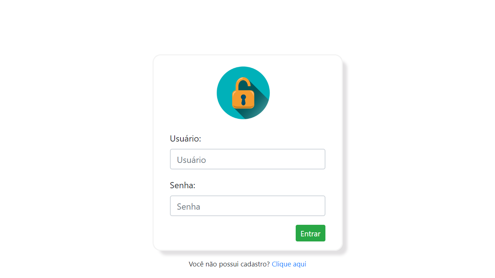
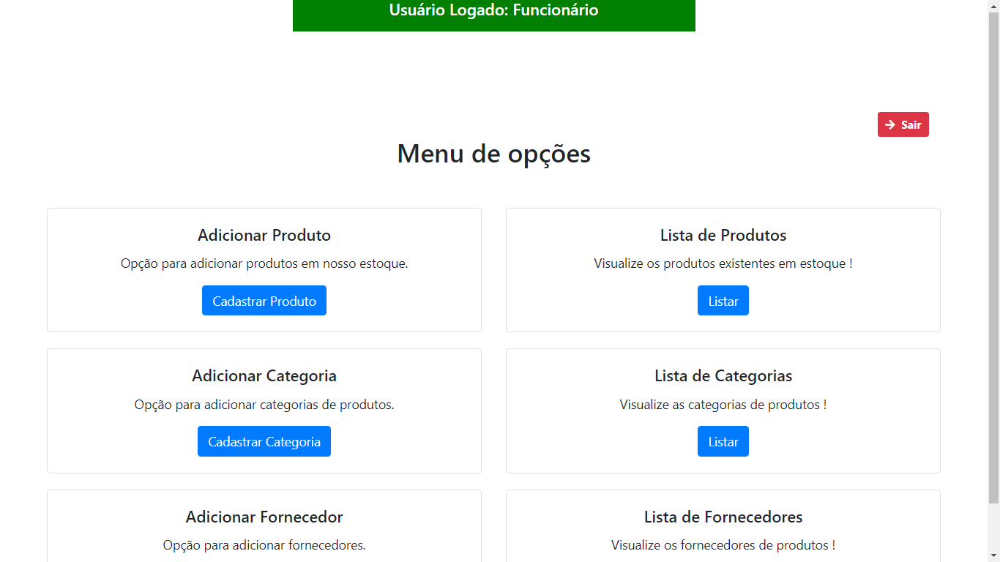

<h1>Crud-Stock-Control</h1>

Controle de estoque feito com HTML, CSS, JS, PHP, SQL e Bootstrap.

  
<h3>Página de login.</h3>

  
<h3>Menu principal.</h3>

  
<h2>Acessando o sistema...</h2>

<ol type="I">
  <li>Instale o app XAMPP na sua máquina;</li>
  <li>Baixe e cole este projeto em c:/xampp/htdocs/(pasta do projeto);</li>
  <li>Na tela principal do XAMPP dê start nos serviços MySQL e Apache;</li>
  <li>Abra o Shell do XAMPP ou faça pelo PhpMyAdmin, executando o arquivo curso-estoque.sql;</li>
  <li>Com a base de dados criada e os serviços em funcionamento, vá até seu navegador e digite "localhost/(pasta do projeto)";</li>
  <li>Abrirá por padrão o arquivo de nome "index";</li>
  <li>Entre com qualquer e-mail e senha abaixo.</li>
</ol>
  
:warning: Verifique o arquivo conexao.php se houver algum problema de conexao com o banco de dados !
 
<h3>Acessos</h3>
<ul>
  <li>Usuário administrador - Email:vagner@gmail.com - senha:casa</li>
  <li>Usuário funcionário - Email:joao@gmail.com - senha:casa</li>
  <li>Usuário conferente - Email:jose@gmail.com - senha:casa</li>
</ul>
  
<h4>Sistema feito no Curso <strong>CRUD básico com Bootstrap 4, PHP e Mysql</strong> do professor <strong>Ricardo Milbrath Gonçalves.</strong></h4>
